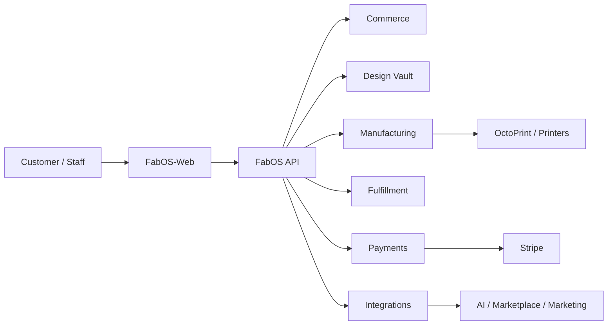
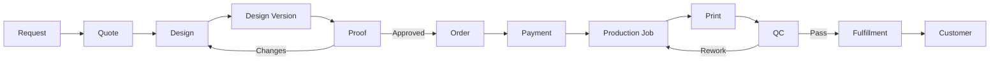

# FabOS

**FabOS is the business and manufacturing operating system behind FABVEX.**

It brings the core operations of a 3D-printing business into one authoritative system: customers, products, variants, pricing, custom quotes, digital designs, proofs, orders, payments, production jobs, printers, quality control, inventory, fulfillment, marketing, and optional AI-assisted operations.

[FabOS-Web](https://github.com/Energex22/FabOS-Web) is the web application layer. FabOS remains the business-logic and persistence authority; the browser is never trusted with authoritative pricing, ownership, payment state, production state, or fulfillment decisions.

> **Current application version:** `0.16.0-beta.7`  
> **Python:** >=3.8  
> **Package metadata:** `pyproject.toml` currently reports `0.1.0`; this should be reconciled before a versioned package release.

## Visual overview

GitHub renders Mermaid diagrams directly in Markdown, so the diagrams below stay versioned with the software and can be updated when the architecture changes.

### What FabOS controls



### From customer request to finished order



### Public deployment

```mermaid
flowchart TB
    Internet --> TLS[HTTPS :443]
    TLS --> Caddy[Caddy]
    Caddy --> Web[FabOS-Web static build]
    Caddy --> API[/api/*]
    API --> App[FabOS FastAPI/Uvicorn]
    App --> DB[(SQLite)]
    App --> Vault[(Design Vault)]
    App --> Stripe[Stripe]
    App --> Octo[OctoPrint]
```

These diagrams are descriptive rather than a substitute for the architecture documentation. See [docs/architecture/ARCHITECTURE.md](docs/architecture/ARCHITECTURE.md).

## What FabOS does

| Area | Capabilities |
| --- | --- |
| **Commerce** | Products, variants, pricing, quotes, quote versions, orders, taxes, shipping, invoices, payments |
| **Customers** | Accounts, authentication, profiles, ownership-scoped quotes and orders |
| **Design & custom work** | Design Vault, uploaded models, versions, customer proofs, approvals, change requests, custom quotes |
| **Manufacturing** | Production jobs, quantities/variants, printer workflows, filament/material tracking, QC, reprints/rework |
| **Fulfillment** | Shipping/pickup state, tracking, customer-safe order progress |
| **Marketing & sales** | Campaigns, channel records, drafts, approval, scheduling/publishing states, marketplace sales normalization |
| **AI** | Provider-neutral assistant, local Ollama support, OpenAI-compatible endpoints, bounded read-only tools and marketing assistance |
| **Extensibility** | Plugin SDK, service/event boundaries, provider-neutral integration seams |
| **Operations** | Settings, backups, audit information, deployment and recovery workflows |

## Architecture

~~~text
FABVEX
  |
  +--> FabOS-Web
  |       Customer / Web Experience
  |
  +--> HTTPS / JSON
          |
          v
       FabOS
       Business Engine
          |
   +------+-------+----------------+
   |              |                |
Commerce      Design Vault     Manufacturing
Customers     Versions         Production jobs
Catalog       Proofs           Printers
Quotes        Uploads          QC / Rework
Orders                         Materials
Payments
   |
   +-------------------+----------------+
                       |                |
                       v                v
                 Marketing Hub     AI / Automation
~~~

### Core architectural rule

**FabOS is authoritative.**

The frontend may keep convenience state such as a shopping cart, but FabOS recalculates and validates:

- customer ownership;
- catalog eligibility;
- product and variant selection;
- pricing;
- tax;
- shipping;
- order totals;
- payment state;
- quote state;
- production state;
- fulfillment state.

The frontend must not become a second business-logic or persistence layer.

## Customer-to-production workflow

~~~text
Customer
   |
   +--> Browse catalog
   +--> Configure product
   +--> Request custom work
             |
             v
        Quote / Design
             |
       +-----+------+
       |            |
    Pricing       Proof
                    |
             Customer approval
                    |
                    v
                  Order
                    |
          +---------+---------+
          |                   |
       Payment            Production
                              |
                            Print
                              |
                             QC
                         +----+----+
                         |         |
                        Pass     Rework
                         |         |
                         +----<----+
                              |
                         Fulfillment
                              |
                           Customer
~~~

For customer-designed work, production is server-enforced to wait for the required latest design proof to be approved.

## Design & custom manufacturing

FabOS is not simply a file upload endpoint. A customer design can remain connected through its full lifecycle:

**customer -> quote -> design -> design version -> proof -> approval -> order -> production**

Supported customer model/reference uploads currently include:

- STL
- 3MF
- OBJ
- STEP/STP

The customer upload limit is currently **25 MB**.

Uploaded files are staged and validated before being imported into the Design Vault. Internal filesystem paths are never returned to customers.

### Design proof workflow

1. Customer submits a design or custom-work request.
2. FabOS stores the design and relevant version.
3. FABVEX can create a proof tied to the exact Design Vault version.
4. The customer reviews the proof.
5. The customer approves it or requests changes.
6. Approval records the account and timestamp.
7. Production creation is blocked until the required latest proof is approved.

See [docs/CUSTOMER_API_CONTRACT.md](docs/CUSTOMER_API_CONTRACT.md).

## Commerce and payments

FabOS owns the server-side order lifecycle.

A customer can:

1. browse published products;
2. select active variants/configuration;
3. submit an order;
4. provide shipping information;
5. have FabOS calculate the authoritative total;
6. create a payment session;
7. complete payment through the configured provider;
8. receive customer-safe order progress.

Stripe is the primary online payment integration. Square is reserved for physical/in-person sales. Payment-provider callbacks reconcile into FabOS's order, invoice, and payment records.

FabOS does **not** store raw card data.

If a payment provider is not configured, the order may still be recorded, but FabOS must never report a fake payment-success state.

See [docs/PAYMENTS.md](docs/PAYMENTS.md).

## Manufacturing and printers

Production jobs are created from server-side order state rather than browser state.

The manufacturing workflow is designed around:

- production jobs;
- requested quantities and variants;
- printer assignment/integration;
- material/filament information;
- print completion/failure;
- QC;
- rework/reprints;
- fulfillment.

OctoPrint integration is supported for printers that are intentionally configured for remote control.

The current production-readiness workflow specifically includes the existing Anycubic Vyper/Cura workflow. Additional printers and integrations can be added through the integration/plugin architecture.

## Marketing & Sales Hub

FabOS includes a provider-neutral Marketing & Sales Hub foundation.

It supports the data/workflow model for:

- products as the marketing source of truth;
- campaigns;
- dates and budgets;
- channel connections;
- drafts;
- approvals;
- scheduling;
- publishing states;
- per-channel external IDs/results;
- external marketplace sales;
- normalized sales reporting.

Provider integration seams cover channels such as Etsy, eBay, Facebook, Instagram, TikTok, Pinterest, Amazon, Shopify, Walmart Marketplace, Google Business Profile, LinkedIn, Threads, email, and future channels.

**Important:** the provider-neutral interfaces exist, while provider-specific OAuth/API adapters are intentionally isolated and remain an area of ongoing integration work. Manual workflows are usable without pretending every provider is fully automated.

See [docs/MARKETING_HUB.md](docs/MARKETING_HUB.md).

## AI Assistant

FabOS includes an optional provider-neutral AI assistant.

Supported modes include:

- disabled — default; no AI network access;
- openai_compatible — any compatible chat-completions endpoint;
- ollama — local Ollama server.

The current bounded assistant can provide:

- general FabOS operations/business chat;
- product-aware marketing assistance;
- marketing package drafts;
- product search/details;
- operational snapshots;
- recent order summaries;
- marketing summaries.

AI is **advisory by default**. It cannot independently:

- publish marketing posts;
- change prices;
- issue refunds;
- create production jobs;
- delete records;
- send customer messages;
- spend money.

Consequential actions require dedicated FabOS workflows and explicit owner approval.

See [docs/AI_ASSISTANT.md](docs/AI_ASSISTANT.md).

## Plugin system

FabOS is designed to add integrations without allowing every integration to write directly to the database.

Plugins should use FabOS services and events, keep network work away from the UI thread, expose health state, shut down cleanly, and use reversible/backed-up migrations.

See [docs/PLUGIN_SDK.md](docs/PLUGIN_SDK.md).

## Current status

FabOS has substantial implemented functionality across the core, commerce, customer API, Design Vault, proofs, payments boundary, production workflow, marketing foundation, and AI assistant.

The project is still under active development. **A passing test/build is not the same thing as a production deployment being validated.**

Before accepting live orders, the actual deployment environment must still be checked for:

- payment credentials and webhooks;
- printer connectivity;
- filesystem permissions;
- DNS;
- TLS;
- persistent storage;
- backups and restore;
- recovery behavior;
- production-specific configuration.

The detailed acceptance and recovery gate is [docs/PRODUCTION_READINESS.md](docs/PRODUCTION_READINESS.md).

## Quick start — development

### Prerequisites

- Python 3.8 or newer;
- Git;
- a writable persistent data directory outside the Git checkout;
- Node.js/npm when working on FabOS-Web.

Create/install the FabOS development environment:

~~~bash
python -m venv .venv
~~~

Windows:

~~~bat
.venv\Scripts\activate
pip install -e .
~~~

Start the development API:

~~~bash
python -m fabos_core.cli serve
~~~

The development API normally binds to:

~~~text
http://127.0.0.1:8000
~~~

Set FABOS_DATA_DIR before first use if you want data somewhere other than the Windows default. Keep the database and Design Vault outside the repository.

### First-run setup and owner configuration

For a fresh persistent data directory, initialize FabOS before exposing the customer boundary:

~~~bash
python -m fabos_core.cli init
~~~

Complete the initial owner/administrator setup explicitly, then configure payment, tax/shipping, and printer settings. The production setup flow also supports the combined `setup-production` workflow. Do not rely on a bootstrap/default owner password in production.

Before going public, create and verify a backup:

~~~bash
python -m fabos_core.cli backup
python -m fabos_core.cli backup-check
~~~

A backup is not considered production-ready until it can be opened/restored separately.

### Windows desktop

The Windows desktop launcher is:

~~~bat
start_fabos.bat
~~~

Do not expose the desktop/admin application through the public Caddy site.

## The two API entry points

FabOS currently has two server entry points. They serve the same business services and route set, but their server stacks and environment handling differ. The supported Windows production storefront launcher uses the FastAPI/Uvicorn entry point; the Waitress entry point remains available for compatibility/alternative deployments.

| | FastAPI/Uvicorn | WSGI/Waitress |
| --- | --- | --- |
| Command | python -m fabos_core.cli serve | python -m fabos_api.server |
| Main use | Development and supported production API | Alternative/legacy server path |
| Host/port | FABOS_API_HOST, FABOS_API_PORT | FABOS_API_HOST, FABOS_API_PORT |
| CORS/origin | FABOS_CORS_ORIGINS | FABOS_API_ALLOW_ORIGIN |
| Other controls | FABOS_ALLOWED_HOSTS, FABOS_API_DOCS | FABOS_API_THREADS |

Do not assume a variable for one server automatically configures the other.

For production, use the deployment launcher and configuration documented by FabOS-Web rather than publishing the development server directly.

## Customer HTTP API

The public customer boundary includes:

- public health;
- published catalog;
- catalog categories;
- authentication;
- customer profile;
- customer quotes;
- custom quote requests/uploads;
- customer orders;
- quote acceptance/decline;
- payment-session creation;
- customer design proofs.

Administrative and internal integration routes remain protected.

Customers never receive:

- another customer's identifiers/data;
- internal production jobs;
- printer information;
- staff notes;
- audit records;
- internal Design Vault paths;
- raw payment credentials;
- provider secrets;
- internal production dossiers.

See [docs/CUSTOMER_API_CONTRACT.md](docs/CUSTOMER_API_CONTRACT.md).

## Configuration and secrets

| Setting | Purpose |
| --- | --- |
| FABOS_DATA_DIR | Persistent database/Design Vault location |
| FABOS_API_HOST | API bind address |
| FABOS_API_PORT | API port |
| FABOS_CORS_ORIGINS | Allowed browser origins when CORS is actually required |
| FABOS_ALLOWED_HOSTS | FastAPI host protection |
| FABOS_API_DOCS | Whether API documentation is intentionally exposed |
| FABOS_API_ALLOW_ORIGIN | Legacy/Waitress origin setting |
| FABOS_API_THREADS | Waitress worker-thread setting |

Payment credentials, printer API keys, AI keys, marketplace credentials, and similar secrets belong in deployment environment/secret storage or the supported settings references. **Do not commit secret values to Git.**

## Production architecture

The intended public Windows deployment is:

~~~text
Internet
   |
 HTTPS :443
   |
   v
+---------+
|  Caddy  |
+----+----+
     |
     +---- /       -> FabOS-Web static files
     |
     +---- /api/*  -> 127.0.0.1:8000
                         |
                         v
                       FabOS
                         |
                         v
                 Persistent data
                 + Design Vault
~~~

The same-origin arrangement keeps the API private and avoids needing a public API hostname.

### Domain and HTTPS

The deployment documentation covers:

- DNS;
- router port forwarding;
- Windows Firewall;
- Caddy;
- automatic TLS certificates;
- dynamic DNS;
- Cloudflare Tunnel fallback;
- service installation.

Do **not** forward port 8000 or the Vite development port to the internet.

If the ISP uses CGNAT, normal inbound port forwarding will not work. Use an outbound tunnel or an appropriate DNS-01/tunnel deployment strategy instead.

See:

- [FabOS-Web Windows deployment](https://github.com/Energex22/FabOS-Web/tree/main/deployment/windows)
- [FabOS-Web domain and HTTPS guide](https://github.com/Energex22/FabOS-Web/blob/main/deployment/windows/DOMAIN_AND_HTTPS.md)

## Production first-run checklist

Before taking a real order:

1. Start FabOS using the intended persistent data directory.
2. Confirm migrations reach the current schema.
3. Create the initial owner/administrator explicitly.
4. Change the initial owner password.
5. Confirm only intentionally published/eligible products appear publicly.
6. Confirm every published product has a usable printable model and customer price.
7. Configure tax, shipping, pricing, and business settings.
8. Configure the payment provider and webhook secret.
9. Configure production printer(s), Cura profile, material and spool information.
10. Run a backup.
11. Restore that backup into a separate test location.
12. Run the customer acceptance workflow.
13. Test payment success, duplicate webhook delivery, failure, and refund behavior.
14. Test a customer design proof before production.
15. Test a production job through print, QC, and fulfillment.
16. Verify customer data isolation.
17. Verify restart/recovery behavior.

The complete checklist is [docs/PRODUCTION_READINESS.md](docs/PRODUCTION_READINESS.md).

## Testing

Run the Python test suite:

~~~bash
python -m unittest discover -s tests -p 'test*.py' -v
~~~

Automated tests prove only what they exercise. They cannot by themselves prove that Stripe, DNS, TLS, printer connectivity, backups, router configuration, filesystem permissions, or deployment secrets are correct.

See [docs/testing/TEST_PLAN.md](docs/testing/TEST_PLAN.md).

## Repository structure

~~~text
FabOS/
├── fabos_core/          Core application and business services
├── fabos_api/           HTTP/API adapters
├── fabos_desktop/       Desktop application
├── fabos_sdk/           Integration/plugin interfaces
├── plugins/             Plugin implementations
├── docs/                Architecture, contracts, security and operations
├── tests/               Automated tests
├── deployment/          Deployment assets
└── start_fabos.bat      Windows desktop launcher
~~~

This is a simplified map; the repository contains additional application modules and release/deployment documentation.

## Documentation map

| Document | Purpose |
| --- | --- |
| [docs/architecture/ARCHITECTURE.md](docs/architecture/ARCHITECTURE.md) | System architecture |
| [docs/CUSTOMER_API_CONTRACT.md](docs/CUSTOMER_API_CONTRACT.md) | Customer API routes and data boundary |
| [docs/PAYMENTS.md](docs/PAYMENTS.md) | Payment boundary and webhooks |
| [docs/PRODUCTION_READINESS.md](docs/PRODUCTION_READINESS.md) | Acceptance, recovery and security gate |
| [PRODUCTION_DEPLOYMENT.md](PRODUCTION_DEPLOYMENT.md) | Deployment planning |
| [docs/security/SECURITY.md](docs/security/SECURITY.md) | Security model |
| [docs/testing/TEST_PLAN.md](docs/testing/TEST_PLAN.md) | Testing strategy |
| [docs/PLUGIN_SDK.md](docs/PLUGIN_SDK.md) | Plugin interface |
| [docs/MARKETING_HUB.md](docs/MARKETING_HUB.md) | Marketing and marketplace model |
| [docs/AI_ASSISTANT.md](docs/AI_ASSISTANT.md) | AI setup and safety boundary |
| [docs/ROADMAP.md](docs/ROADMAP.md) | Planned work |
| [deployment/windows/README.md](deployment/windows/README.md) | Windows deployment/backups/host hardening |

## Roadmap

Current development areas include:

- deeper automation and durable workflows;
- CAD/modeling and manufacturing-assistance workflows as they are promoted from experiments into supported production capabilities;
- additional marketplace/provider adapters;
- broader printer integrations;
- advanced production intelligence;
- learned estimates and forecasting;
- optimization/recommendation systems;
- expanded customer/business web workflows;
- additional clients and integrations.

The roadmap should be read alongside the implemented capabilities in this README rather than as a list of features that are all still unbuilt.

## Operating and security rules

- Keep persistent data outside the Git checkout.
- Never commit database files, customer uploads, payment secrets, printer API keys, AI keys, OAuth tokens, or other credentials.
- Keep the FabOS API private behind the reverse proxy in production.
- Do not expose the desktop/admin interface publicly.
- Do not use a development server as the public production server.
- Validate ownership and permissions on the server, not just in the UI.
- Keep backups outside the public web root.
- Test restoration, not just backup creation.
- Treat external payment webhooks as repeatable/idempotent events.
- Do not assume CI passing proves deployment readiness.

## Contributing

When changing FabOS:

1. Understand the existing service/API boundary before adding duplicate business logic.
2. Keep customer-facing data filtered at the API boundary.
3. Preserve server-side ownership and eligibility checks.
4. Add or update tests for changed behavior.
5. Keep secrets and persistent runtime data out of Git.
6. Update the relevant documentation when public behavior or deployment requirements change.

## License

The repository's licensing terms should be kept in sync with the repository's actual license file. Do not assume a license from this README alone.
